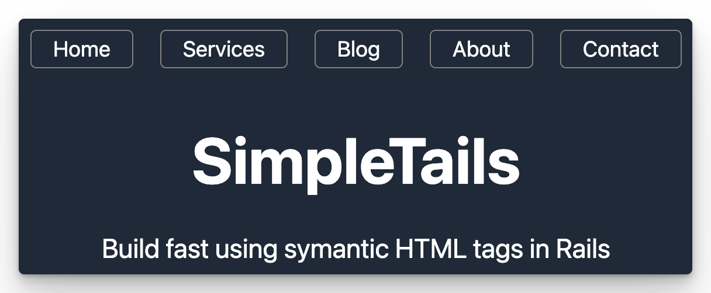

# SimpleTails

SimpleTails is inspired by [Simple.CSS](https://simplecss.org/) a classless CSS framework that makes semantic HTML look good.

I wanted a way to to have sensible styling in a Rails application with minimal setup with the added bonus of being abble to easily change the defaults or overide them.

SimpleTails leverages the [official Tailwind CSS Typography plugin](https://tailwindcss.com/docs/typography-plugin) `prose` classes with some custom setup.
This makes it possible to have default styling out the box.

---
## Bennefits


<details>
  <summary>📘 <h3>Typography Example</h3><p> Click to view</p></summary>

HTML heading tags and unordered lists

```html
<h1>Heading 1</h1>
<h2>Heading 2</h2>
<h3>Heading 3</h3>
<ul>
  <li>
    <strong>I am bold</strong>
  </li>
  <li>
    <em>I am italic</em>
  </li>
  <li>
    <u>I am underlined</u>
  </li>
</ul>
```


</details>

<details>
  <summary>📂 <h3>Basic Table Example</h3><p> Click to view</p></summary>

A table with just enough styling can be rendered from something like this 

```html 
<table>
  <thead>
    <tr>
      <th>Name</th>
      <th>Number</th>
    </tr>
  </thead>
  <tbody>
    <% %w(John Sally Mary Peter Simon James).shuffle.each do |name| %>
      <tr>
        <td>  <%= name %></td>
        <td><%= rand(99999) %></td>
      </tr>
    <% end %>
  </tbody>
</table>
```

Resulting in this


</details>


---
<details>
  <summary>Basic Table Example<h4>Click to see</h4></summary>

For a quick header and navigation solution
```html
<header>
  <nav>
    <%= link_to "Home", root_path %>
    <%= link_to "Services", services_path %>
    <%= link_to "Blog", posts_path %>
    <%= link_to "About", about_us_path %>
    <%= link_to "Contact", contacts_path %>
  </nav>
  <h1 class="">SimpleTails</h1>
  <p>Build fast using symantic HTML tags in Rails</p>
</header>
```
Resulting in this



</details>


All the magic is here: [simple_tails.css](app/assets/stylesheets/simple_tails.css)

> This Rails app exist for the purpose of of developing and refining SimpleTails.

---


## Usage: 

**Prerequisites:** 
 - You have TailwindCSS installed and working in your Rails app
 - You have the [`@tailwindcss/typography`](https://tailwindcss.com/docs/typography-plugin) plugin installed

1. Copy the [simple_tails.css](app/assets/stylesheets/simple_tails.css) file found in this project to your app.
2. In your `application.css` import that file. 

```css
@import "tailwindcss/base";
@import "tailwindcss/components";
@import "tailwindcss/utilities";

@import "./simple_tails.css";
```
 NB: Note that we use the following css import directive for the TailwindCSS imports.
```css
@import "tailwindcss/base";
@import "tailwindcss/components";
@import "tailwindcss/utilities";
```

---- 

## Developing or trying it out via this app.

Clone this repo 
```shell
git clone git@github.com:davidteren/simple_tails.git
```
Change into the project directory
```shell
cd simple_tails
```

Run the setup script
```shell
./bin/setup
```

If the app is not started after the setup run 
```shell
./bin/dev
```

Visit [127.0.0.1:3000](http://127.0.0.1:3000/)

Loging using the following credentials:

| Email            | Password |
|------------------|----------|
| user@example.com | pass123  |

---

## Example Screenshot


### Contribute

Please feel free to do so 🚀